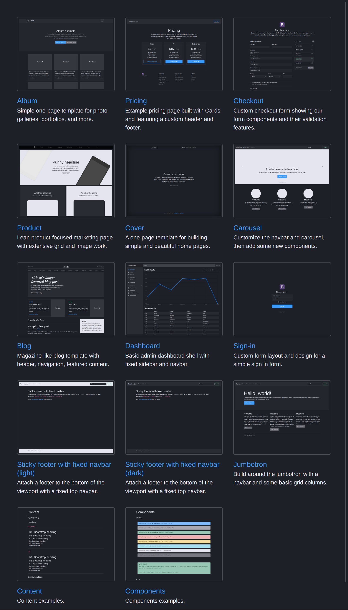
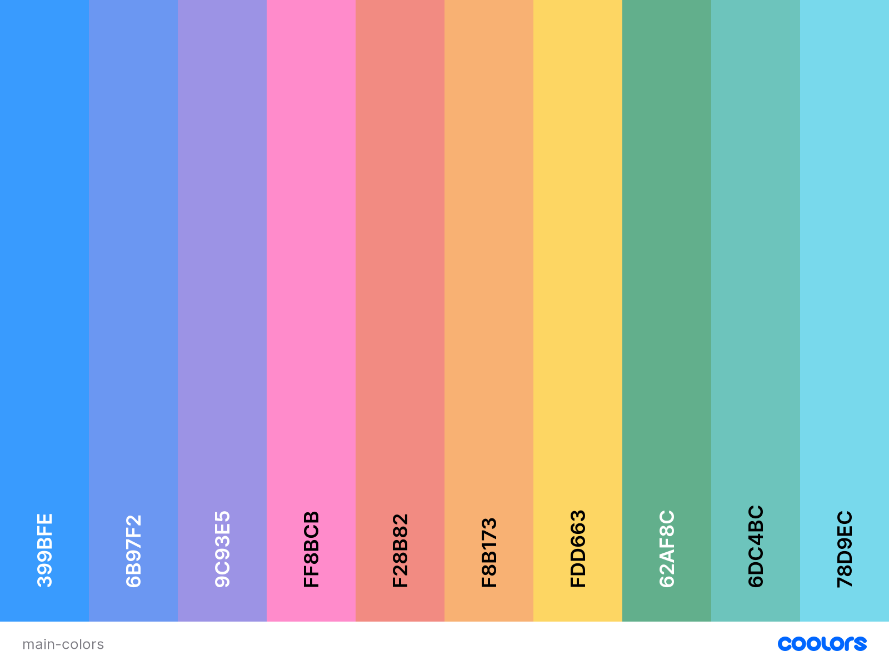
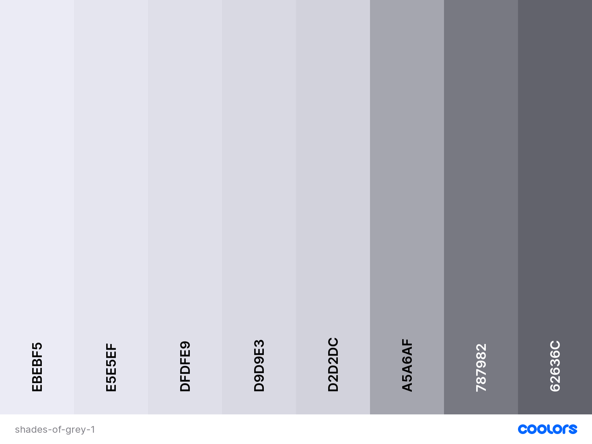
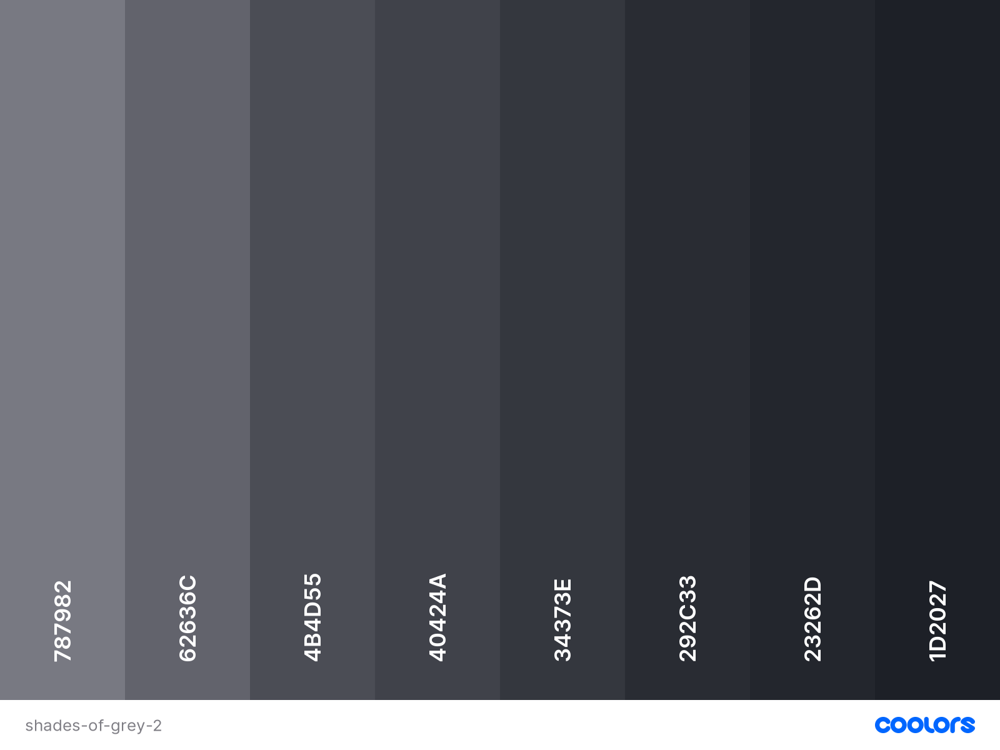

// settings:
:toc: macro
:toclevels: 2
:numbered:
:sectnumlevels: 2

ifndef::env-github[:icons: font]
ifdef::env-github[]
:status:
:outfilesuffix: .adoc
:caution-caption: :fire:
:important-caption: :exclamation:
:note-caption: :paperclip:
:tip-caption: :bulb:
:warning-caption: :warning:
endif::[]

// variables:

:project: bootstrap-dark-mode
:uri-org: https://github.com/jprivet-dev
:uri-repo: {uri-org}/{project}

:uri-rel-file-base: link:
:uri-rel-tree-base: link:
ifdef::env-site,env-yard[]
:uri-rel-file-base: {uri-repo}/blob/master/
:uri-rel-tree-base: {uri-repo}/tree/master/
endif::[]

:uri-license: {uri-rel-file-base}LICENSE

:BACK_TO_TOP_TARGET: top-target
:BACK_TO_TOP_LABEL: ⬆ Back to top
:BACK_TO_TOP: <<{BACK_TO_TOP_TARGET},{BACK_TO_TOP_LABEL}>>

[#{BACK_TO_TOP_TARGET}]
= Bootstrap 4.6 - Dark Mode (v4.6.0-beta.0)

toc::[]

== Presentation

Create your own Bootstrap dark mode *by changing only variables*.

See the result on https://jprivet-dev.github.io/bootstrap-dark-mode/:



{BACK_TO_TOP}

== Quick start

* Clone the repo: `git clone {uri-repo}`
* Go in the project: `cd {project}`
* Install with https://www.npmjs.com/[npm]: `npm install`
* Start the server: `npm run dev-server`
* Go on http://localhost:8080/

{BACK_TO_TOP}

== Create your own theme

=== The default variables of Bootstrap

Every Sass variable in Bootstrap includes the `!default` flag allowing you to override the variable’s default value
in your own Sass without modifying Bootstrap’s source code (https://getbootstrap.com/docs/4.6/getting-started/theming/#variable-defaults).

See the file on https://github.com/twbs/bootstrap/blob/v4.6.0/scss/_variables.scss.

{BACK_TO_TOP}

=== Your own variables

This project imports the precompiled Sass with https://symfony.com/doc/current/frontend.html#webpack-encore[Webpack Encore]:

* https://symfony.com/doc/current/frontend.html#webpack-encore
* https://getbootstrap.com/docs/4.6/getting-started/webpack/#importing-precompiled-sass

Create your own `_variables.scss` and use it to override the built-in custom variables.
Then, use your main Sass file to import your custom variables, followed by Bootstrap:

.{uri-rel-file-base}assets/styles/app.scss[]
```css
@import "variables";
@import "~bootstrap/scss/bootstrap";
```

{BACK_TO_TOP}

=== The colors of this dark mode version

Find all the colors used in {uri-rel-file-base}assets/styles/app.scss[].

TIP: The colors were inspired by the different interfaces I could find on Pinterest: https://www.pinterest.fr/jeanphilipperivet/ui-dark-version/

Main colors (https://coolors.co/399bfe-6b97f2-9c93e5-ff8bcb-f28b82-f8b173-fdd663-62af8c-6dc4bc-78d9ec[see on coolors.co]):



Shades of grey 1 (https://coolors.co/ebebf5-e5e5ef-dfdfe9-d9d9e3-d2d2dc-a5a6af-787982-62636c[see on coolors.co]):



Shades of grey 2 (https://coolors.co/787982-62636c-4b4d55-40424a-34373e-292c33-23262d-1d2027[see on coolors.co]):



Voilà ! All you have to do is vary the colors 😃

{BACK_TO_TOP}

== License

{uri-repo} is released under the {uri-license}[licence MIT].

'''

{BACK_TO_TOP}

